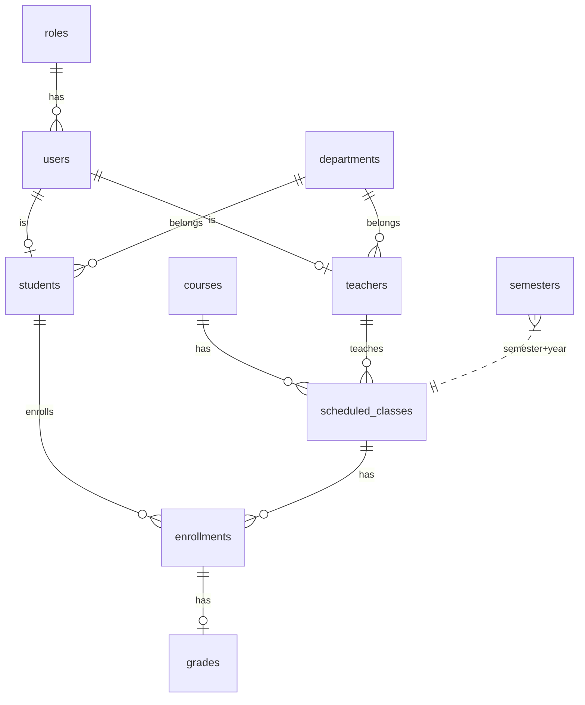

# Admin Module - Phân Tích Hệ Thống & Thiết Kế Use Cases Chi Tiết

## 1. Phân Tích Database Schema

### 1.1 Entity Relationship Diagram



### 1.2 Bảng Tổng Hợp Schema

| Bảng | PK Type | Soft Delete | Quan hệ chính |
|------|---------|-------------|----------------|
| `roles` | INT (auto) | ✅ `deleted_at` | → users |
| `departments` | INT (auto) | ✅ | → teachers, students |
| `users` | UUID | ✅ | → roles, → teachers/students |
| `teachers` | UUID | ✅ | → users (1:1), → departments |
| `students` | UUID | ✅ | → users (1:1), → departments |
| `courses` | INT (auto) | ✅ | → scheduled_classes |
| `scheduled_classes` | INT (auto) | ✅ | → courses, → teachers |
| `enrollments` | INT (auto) | ✅ | → students, → scheduled_classes |
| `grades` | INT (auto) | ✅ | → enrollments |
| `semesters` | INT (auto) | ✅ | Unique(name, year), chỉ 1 `is_current=true` |

### 1.3 Đặc Điểm Quan Trọng

- **Soft delete**: Tất cả bảng đều có `deleted_at` → Admin nên dùng soft delete
- **Audit fields**: `created_at`, `updated_at`, `created_by`, `updated_by` → Phải ghi nhận admin action
- **User-Profile 1:1**: `users` ↔ `teachers`/`students` qua `user_id` (UNIQUE FK)
- **Roles**: ADMIN (1), TEACHER (2), STUDENT (3) — cố định
- **Status flow**: `PENDING_VERIFICATION` → `ACTIVE` ↔ `INACTIVE` / `BLOCKED`

---

## 2. Admin Module - Tổng Quan

### 2.1 Admin UC Map

```
┌─────────────────────────────────────────────────────────────────┐
│                      ADMIN MODULE                                │
├─────────────────────────────────────────────────────────────────┤
│                                                                  │
│  ┌──────────────┐  ┌──────────────┐  ┌──────────────┐          │
│  │  UC-11       │  │  UC-13       │  │  UC-15       │          │
│  │  Users CRUD  │  │  Departments │  │  Teachers    │          │
│  │  + Status    │  │  CRUD        │  │  CRUD        │          │
│  └──────────────┘  └──────────────┘  └──────────────┘          │
│                                                                  │
│  ┌──────────────┐  ┌──────────────┐  ┌──────────────┐          │
│  │  UC-17       │  │  UC-19       │  │  UC-21       │          │
│  │  Students    │  │  Courses     │  │  Classes     │          │
│  │  CRUD        │  │  CRUD        │  │  CRUD        │          │
│  └──────────────┘  └──────────────┘  └──────────────┘          │
│                                                                  │
│  ┌──────────────┐  ┌──────────────┐                             │
│  │  UC-28       │  │  UC-29       │                             │
│  │  Semesters   │  │  Dashboard   │                             │
│  │  CRUD        │  │  Statistics  │                             │
│  └──────────────┘  └──────────────┘                             │
│                                                                  │
└─────────────────────────────────────────────────────────────────┘
```

### 2.2 Common Patterns

> [!IMPORTANT]
> Tất cả Admin endpoints đều yêu cầu `Authorization: Bearer {token}` với `role = ADMIN`.
> Mọi thao tác CRUD đều sử dụng **soft delete** (`deleted_at = NOW()`), **KHÔNG** physical delete.

**Pagination Pattern (GET list):**
```
Query Params: ?page=0&size=20&sort=createdAt,desc&search=keyword
```

**Common Error Codes (tất cả admin endpoints):**

| Code | Message | HTTP Status |
|------|---------|-------------|
| 9000 | Unauthorized | 401 |
| 9001 | Access denied - Admin role required | 403 |
| 9002 | Resource not found | 404 |
| 9003 | Duplicate resource | 409 |
| 9004 | Resource is in use, cannot delete | 400 |

---

## 3. Chi Tiết Từng Use Case

---

### UC-11: Quản Lý Users (Admin) — Chi Tiết

| Thuộc tính | Giá trị |
|------------|---------|
| **Base URL** | `/admin/users` |
| **Actor** | Admin |
| **Mục đích** | CRUD tài khoản (Teacher/Student), quản lý trạng thái, reset password |

> [!IMPORTANT]
> - Tài khoản **ADMIN** là mặc định (seeded), **KHÔNG** tạo thêm qua API.
> - Admin **KHÔNG** thể tự xóa chính mình.
> - Khi tạo user, admin chọn role (`TEACHER` hoặc `STUDENT`) → form hiển thị các field tương ứng.

#### UC-11.1: Danh Sách Users

**Endpoint:** `GET /admin/users`

**Query Params:**

| Param | Type | Default | Mô tả |
|-------|------|---------|-------|
| `page` | int | 0 | Trang hiện tại |
| `size` | int | 20 | Số record/trang (max 100) |
| `sort` | string | `createdAt,desc` | Sắp xếp |
| `search` | string | | Tìm theo email |
| `status` | string | | Filter: `ACTIVE`, `INACTIVE`, `BLOCKED`, `PENDING_VERIFICATION` |
| `roleId` | int | | Filter theo role (1=ADMIN, 2=TEACHER, 3=STUDENT) |

**Response:**
```json
{
  "code": 1000,
  "result": {
    "content": [
      {
        "userId": "uuid-001",
        "email": "admin@fpt.edu.vn",
        "role": { "roleId": 1, "roleName": "ADMIN" },
        "status": "ACTIVE",
        "emailVerified": true,
        "profilePictureUrl": null,
        "lastLoginAt": "2026-02-10T08:00:00",
        "loginCount": 42,
        "createdAt": "2025-09-01T08:00:00"
      }
    ],
    "page": 0,
    "size": 20,
    "totalElements": 22,
    "totalPages": 2
  }
}
```

#### UC-11.2: Xem Chi Tiết User

**Endpoint:** `GET /admin/users/{userId}`

**Response:** Trả về thông tin user + profile tương ứng (student/teacher nếu có):
```json
{
  "code": 1000,
  "result": {
    "userId": "uuid-201",
    "email": "hoang.minh.tuan@fpt.edu.vn",
    "role": { "roleId": 3, "roleName": "STUDENT" },
    "status": "ACTIVE",
    "emailVerified": true,
    "banReason": null,
    "lastLoginAt": "2026-02-10T07:30:00",
    "loginCount": 45,
    "createdAt": "2025-09-01T08:00:00",
    "studentProfile": {
      "studentId": "uuid-2001",
      "studentCode": "HE170001",
      "firstName": "Tuan",
      "lastName": "Hoang Minh",
      "dob": "2003-03-15",
      "gender": "MALE",
      "major": "Software Engineering",
      "email": "hoang.minh.tuan@fpt.edu.vn",
      "phone": "0912000001",
      "address": "12 Tran Phu, Ha Noi",
      "gpa": 3.45,
      "department": { "departmentId": 1, "name": "Computer Science" }
    },
    "teacherProfile": null
  }
}
```

#### UC-11.3a: Tạo Từng User (Teacher hoặc Student)

**Endpoint:** `POST /admin/users`

```
┌───────┐      ┌──────────────────┐      ┌────────────┐      ┌────────────┐
│ Admin │      │  Admin Service   │      │ PostgreSQL │      │ Email SMTP │
└───┬───┘      └────────┬─────────┘      └──────┬─────┘      └─────┬──────┘
    │                   │                       │                  │
    │ 1. POST /admin/users                      │                  │
    │    {role, email, profile fields}           │                  │
    │──────────────────►│                       │                  │
    │                   │                       │                  │
    │                   │ 2. Validate ALL fields│                  │
    │                   │ 3. Check unique:      │                  │
    │                   │    email + code       │                  │
    │                   │──────────────────────►│                  │
    │                   │◄──────────────────────│                  │
    │                   │                       │                  │
    │                   │ 4. Generate random pw │                  │
    │                   │ 5. Create users record│                  │
    │                   │    (PENDING_VERIF.)   │                  │
    │                   │ 6. Create profile:    │                  │
    │                   │    teachers/students  │                  │
    │                   │──────────────────────►│                  │
    │                   │                       │                  │
    │                   │ 7. Send welcome email │                  │
    │                   │    (email+pw+activate)│                  │
    │                   │──────────────────────────────────────────►│
    │                   │                       │                  │
    │ 8. Return user + profile                  │                  │
    │◄──────────────────│                       │                  │
```

**Request khi `role = TEACHER`:**
```json
{
  "role": "TEACHER",
  "email": "nguyen.thi.hoa@fpt.edu.vn",
  "departmentId": 1,
  "teacherCode": "HJ170006",
  "firstName": "Hoa",
  "lastName": "Nguyen Thi",
  "dob": "1985-03-15",
  "phone": "0901000006",
  "address": "123 Nguyen Trai, Ha Noi",
  "specialization": "Cloud Computing",
  "academicRank": "Lecturer",
  "officeRoom": "A-301"
}
```

**Request khi `role = STUDENT`:**
```json
{
  "role": "STUDENT",
  "email": "tran.thi.anh@fpt.edu.vn",
  "departmentId": 1,
  "studentCode": "HE170016",
  "firstName": "Anh",
  "lastName": "Tran Thi",
  "dob": "2003-05-20",
  "gender": "FEMALE",
  "major": "Software Engineering",
  "phone": "0912000016",
  "address": "100 Le Loi, HCM"
}
```

> [!IMPORTANT]
> - Admin chọn `role` → form hiển thị các field tương ứng.
> - **KHÔNG** tạo tài khoản ADMIN (tài khoản Admin là mặc định, seeded trong DB).
> - Password **tự generate** (12 ký tự: chữ hoa + thường + số + ký tự đặc biệt).
> - User tạo xong có `status = PENDING_VERIFICATION` → phải **click activation link trong email**.

**Common fields (cả 2 role):**

| Field | Rule |
|-------|------|
| role | Required, enum: `TEACHER` / `STUDENT` |
| email | Required, valid format, unique |
| departmentId | Required, must exist |
| firstName | Required, max 50 |
| lastName | Required, max 50 |
| dob | Optional, DATE, phải trong quá khứ |
| phone | Optional, max 20 |
| address | Optional, max 255 |

**Teacher-only fields** (required khi `role = TEACHER`):

| Field | Rule |
|-------|------|
| teacherCode | Required, format `HJxxxxxx`, unique |
| specialization | Optional, max 100 |
| academicRank | Optional, max 50 |
| officeRoom | Optional, max 50 |

**Student-only fields** (required khi `role = STUDENT`):

| Field | Rule |
|-------|------|
| studentCode | Required, format `HExxxxxx`, unique |
| gender | Optional, enum: MALE/FEMALE/OTHER |
| major | Optional, max 100 |
| gpa | System-managed, KHÔNG set khi tạo |

**Welcome Email gửi cho user:**
```
Subject: [Student Management] Tài khoản của bạn đã được tạo

Xin chào {firstName} {lastName},

Tài khoản của bạn đã được tạo trong hệ thống Student Management.

  Email:    nguyen.thi.hoa@fpt.edu.vn
  Mật khẩu: Abc@12345xyz

Vui lòng click link dưới đây để kích hoạt tài khoản:
  https://domain/auth/activate?token=xxx

Link kích hoạt có hiệu lực trong 72 giờ.
Sau khi kích hoạt, khuyến khích đổi mật khẩu ngay.
```

**Activation Flow:**
```
User nhận email → Click activation link
  → GET /auth/activate?token=xxx
  → Validate token (Redis, TTL 72h)
  → Update user: status=ACTIVE, emailVerified=true
  → Delete token → User có thể login
```

**Error Responses:**

| Code | Message | HTTP |
|------|---------|------|
| 1200 | User already exists | 409 |
| 1100 | Email is required | 400 |
| 1101 | Invalid email format | 400 |
| 1201 | Invalid role (must be TEACHER or STUDENT) | 400 |
| 1202 | Teacher code already exists | 409 |
| 1203 | Student code already exists | 409 |

#### UC-11.3b: Import Users từ Excel

**Endpoint:** `POST /admin/users/import`

**Content-Type:** `multipart/form-data`

> [!NOTE]
> Có **2 template** riêng biệt cho Teacher và Student. Admin chọn đúng template theo loại user cần import.

**Template A — Import Teachers:**

| Column | Required | Mô tả | Ví dụ |
|--------|----------|-------|-------|
| A: `teacherCode` | ✅ | Mã GV | HJ170006 |
| B: `firstName` | ✅ | Họ | Hoa |
| C: `lastName` | ✅ | Tên | Nguyen Thi |
| D: `email` | ✅ | Email | hoa@fpt.edu.vn |
| E: `departmentName` | ✅ | Tên khoa | Computer Science |
| F: `dob` | | Ngày sinh | 1985-03-15 |
| G: `phone` | | SĐT | 0901000006 |
| H: `address` | | Địa chỉ | 123 Nguyen Trai |
| I: `specialization` | | Chuyên môn | AI |
| J: `academicRank` | | Học hàm | Lecturer |
| K: `officeRoom` | | Phòng | A-301 |

**Template B — Import Students:**

| Column | Required | Mô tả | Ví dụ |
|--------|----------|-------|-------|
| A: `studentCode` | ✅ | Mã SV | HE170016 |
| B: `firstName` | ✅ | Họ | Anh |
| C: `lastName` | ✅ | Tên | Tran Thi |
| D: `email` | ✅ | Email | anh@fpt.edu.vn |
| E: `departmentName` | ✅ | Tên khoa | Computer Science |
| F: `dob` | | Ngày sinh | 2003-05-20 |
| G: `gender` | | Giới tính | MALE / FEMALE |
| H: `major` | | Chuyên ngành | Software Engineering |
| I: `phone` | | SĐT | 0912000016 |
| J: `address` | | Địa chỉ | 100 Le Loi, HCM |

> [!TIP]
> Hệ thống tự detect loại template dựa trên header row (có `teacherCode` → Teacher, có `studentCode` → Student).

**Logic mỗi row:**
1. Validate fields + check unique (email, code)
2. Lookup `departmentName` → `departmentId`
3. Generate random password
4. Create `users` record (`PENDING_VERIFICATION`) + profile record
5. **Gửi welcome email** (email + password + activation link)
6. Row lỗi → skip, ghi vào `failures`

**Response:**
```json
{
  "code": 1000,
  "result": {
    "totalRows": 50,
    "successCount": 47,
    "failureCount": 3,
    "emailsSent": 47,
    "failures": [
      { "row": 5, "email": "duplicate@fpt.edu.vn", "error": "Email already exists" },
      { "row": 12, "email": "bad-email", "error": "Invalid email format" },
      { "row": 30, "email": "", "error": "Email is required" }
    ]
  }
}
```

**Business Rules:**
- File max **10 MB**, max **500 rows** per import
- Mỗi user: `status = PENDING_VERIFICATION`, random password
- **Gửi welcome email** cho mỗi user thành công
- Activation token TTL: **72 giờ**
- Import là **partial** — row lỗi bị skip, row hợp lệ vẫn insert
- Java library: **Apache POI** để đọc `.xlsx`

> [!WARNING]
> Import >100 users → gửi email nên dùng **async queue** (Spring `@Async`) để tránh timeout.

**Download Templates:**
- `GET /admin/users/import/template?role=TEACHER` → Template A
- `GET /admin/users/import/template?role=STUDENT` → Template B

**Error Responses:**

| Code | Message | HTTP |
|------|---------|------|
| 9010 | File is required | 400 |
| 9011 | Invalid file format. Only .xlsx allowed | 400 |
| 9012 | File too large (max 10MB) | 400 |
| 9013 | Too many rows (max 500) | 400 |
| 9014 | Invalid template format (missing required columns) | 400 |

#### UC-11.4: Cập Nhật User

**Endpoint:** `PUT /admin/users/{userId}`

**Request:**
```json
{
  "email": "updated@fpt.edu.vn",
  "roleId": 2,
  "status": "ACTIVE"
}
```

> [!WARNING]
> Thay đổi `roleId` cần cẩn thận: nếu đổi từ STUDENT → TEACHER, cần xóa student profile và tạo teacher profile.

**Admin có thể cập nhật:**

| Field | Mô tả |
|-------|-------|
| email | Đổi email (check unique) |
| roleId | Đổi role |
| status | Đổi trạng thái |

#### UC-11.5: Thay Đổi Trạng Thái User (Block/Unblock)

**Endpoint:** `PATCH /admin/users/{userId}/status`

```
┌───────┐      ┌──────────────────┐      ┌────────────┐      ┌───────┐
│ Admin │      │  Admin Service   │      │ PostgreSQL │      │ Redis │
└───┬───┘      └────────┬─────────┘      └──────┬─────┘      └───┬───┘
    │                   │                       │                │
    │ 1. PATCH /admin/users/{id}/status         │                │
    │──────────────────►│                       │                │
    │                   │                       │                │
    │                   │ 2. Validate transition│                │
    │                   │ 3. Update status      │                │
    │                   │──────────────────────►│                │
    │                   │                       │                │
    │                   │ 4. If BLOCKED:        │                │
    │                   │    Increment token version             │
    │                   │    Delete refresh tokens               │
    │                   │────────────────────────────────────────►│
    │                   │                       │                │
    │ 5. Return updated user                    │                │
    │◄──────────────────│                       │                │
```

**Request:**
```json
{
  "status": "BLOCKED",
  "banReason": "Vi phạm nội quy trường"
}
```

**Transition Rules (State Machine):**
```
┌─────────────────────┐     ┌─────────────┐
│ PENDING_VERIFICATION│────►│   ACTIVE    │
└─────────────────────┘     └──────┬──────┘
                                   │  ▲
                          block ▼  │ unblock
                            ┌──────┴──────┐
                            │   BLOCKED   │
                            └──────┬──────┘
                                   │
                    Admin can also set:
                            ┌──────┴──────┐
                            │  INACTIVE   │
                            └─────────────┘
```

| Transition | Allowed | Side Effect |
|------------|---------|-------------|
| ACTIVE → BLOCKED | ✅ | Force logout (increment token version + xóa refresh tokens) |
| BLOCKED → ACTIVE | ✅ | Clear `banReason` |
| ACTIVE → INACTIVE | ✅ | Force logout |
| INACTIVE → ACTIVE | ✅ | — |
| PENDING → ACTIVE | ✅ | Set `emailVerified = true` |
| BLOCKED → BLOCKED | ❌ | Error |

> [!CAUTION]
> Khi block user: phải increment token version trong Redis + xóa tất cả refresh tokens → user bị force logout ngay lập tức trên mọi thiết bị.

#### UC-11.6: Reset Password (Admin)

**Endpoint:** `POST /admin/users/{userId}/reset-password`

**Request:**
```json
{
  "newPassword": "TempPassword123!"
}
```

**Logic:**
1. Hash mật khẩu mới
2. Update `password_hash` trong DB
3. Increment token version (force logout mọi thiết bị)
4. Xóa tất cả refresh tokens

#### UC-11.7: Soft Delete User

**Endpoint:** `DELETE /admin/users/{userId}`

**Logic:**
1. Set `deleted_at = NOW()`, `updated_by = admin`
2. Soft delete profile liên quan (student/teacher)
3. Force logout (increment token version + xóa refresh tokens)

> [!WARNING]
> Không cho phép Admin tự xóa chính mình.

---

### UC-13: Quản Lý Khoa (Admin) — Chi Tiết

| Thuộc tính | Giá trị |
|------------|---------|
| **Base URL** | `/admin/departments` |
| **Actor** | Admin |

#### UC-13.1: Danh Sách Khoa

**Endpoint:** `GET /admin/departments`

**Query Params:** `?page=0&size=20&search=Computer`

**Response:**
```json
{
  "code": 1000,
  "result": {
    "content": [
      {
        "departmentId": 1,
        "name": "Computer Science",
        "officeLocation": "Building A, Room 101",
        "teacherCount": 5,
        "studentCount": 3,
        "createdAt": "2025-09-01T00:00:00"
      }
    ],
    "page": 0, "size": 20, "totalElements": 5, "totalPages": 1
  }
}
```

> [!NOTE]
> `teacherCount` và `studentCount` là **computed fields** (COUNT từ bảng teachers/students WHERE `department_id = ?` AND `deleted_at IS NULL`).

#### UC-13.2: Tạo Khoa

**Endpoint:** `POST /admin/departments`

```json
{ "name": "Data Science", "officeLocation": "Building F, Room 601" }
```

**Validation:**

| Field | Rule |
|-------|------|
| name | Required, max 100, unique (case-insensitive) |
| officeLocation | Optional, max 100 |

#### UC-13.3: Cập Nhật Khoa

**Endpoint:** `PUT /admin/departments/{departmentId}`

```json
{ "name": "Computer Science & Engineering", "officeLocation": "Building A, Room 102" }
```

#### UC-13.4: Xóa Khoa (Soft Delete)

**Endpoint:** `DELETE /admin/departments/{departmentId}`

**Business Rule:** Không cho xóa nếu còn teacher/student thuộc khoa này (`deleted_at IS NULL`).

| Điều kiện | Kết quả |
|-----------|---------|
| Còn teacher/student active | Error 9004: "Department has active members" |
| Không còn ai | Soft delete OK |

---

### UC-15: Quản Lý Giảng Viên (Admin) — Chi Tiết

| Thuộc tính | Giá trị |
|------------|---------|
| **Base URL** | `/admin/teachers` |
| **Actor** | Admin |

#### UC-15.1: Danh Sách Giảng Viên

**Endpoint:** `GET /admin/teachers`

**Query Params:**

| Param | Mô tả |
|-------|-------|
| `search` | Tìm theo tên, email, teacherCode |
| `departmentId` | Filter theo khoa |
| `page`, `size`, `sort` | Phân trang |

**Response:**
```json
{
  "code": 1000,
  "result": {
    "content": [
      {
        "teacherId": "uuid-1001",
        "teacherCode": "HJ170001",
        "firstName": "An",
        "lastName": "Nguyen Van",
        "email": "nguyen.van.an@fpt.edu.vn",
        "phone": "0901000001",
        "specialization": "Artificial Intelligence",
        "academicRank": "Associate Professor",
        "officeRoom": "A-201",
        "department": { "departmentId": 1, "name": "Computer Science" },
        "user": { "userId": "uuid-101", "status": "ACTIVE" },
        "classCount": 4
      }
    ],
    "page": 0, "size": 20, "totalElements": 5, "totalPages": 1
  }
}
```

> [!NOTE]
> Tạo giảng viên mới → sử dụng `POST /admin/users` với `role: "TEACHER"` (UC-11.3a).
> Import giảng viên hàng loạt → sử dụng `POST /admin/users/import` với Template Teacher (UC-11.3b).


#### UC-15.3: Cập Nhật Giảng Viên

**Endpoint:** `PUT /admin/teachers/{teacherId}`

Admin có thể update **tất cả field** (bao gồm các field mà Teacher tự mình không được sửa):

```json
{
  "departmentId": 2,
  "teacherCode": "HJ170006",
  "firstName": "Hoa",
  "lastName": "Nguyen Thi",
  "email": "nguyen.thi.hoa@fpt.edu.vn",
  "phone": "0901000006",
  "specialization": "DevOps",
  "academicRank": "Senior Lecturer",
  "officeRoom": "B-101"
}
```

#### UC-15.4: Xóa Giảng Viên (Soft Delete)

**Endpoint:** `DELETE /admin/teachers/{teacherId}`

**Business Rule:** Không xóa nếu đang dạy lớp trong kỳ hiện tại.

| Điều kiện | Kết quả |
|-----------|---------|
| Đang dạy lớp kỳ hiện tại | Error 9004: "Teacher has active classes" |
| Không dạy lớp nào | Soft delete teacher + soft delete user liên kết |

---

### UC-17: Quản Lý Sinh Viên (Admin) — Chi Tiết

| Thuộc tính | Giá trị |
|------------|---------|
| **Base URL** | `/admin/students` |
| **Actor** | Admin |

#### UC-17.1: Danh Sách Sinh Viên

**Endpoint:** `GET /admin/students`

**Query Params:**

| Param | Mô tả |
|-------|-------|
| `search` | Tìm theo tên, email, studentCode |
| `departmentId` | Filter theo khoa |
| `major` | Filter theo chuyên ngành |
| `gender` | Filter: MALE, FEMALE |
| `page`, `size`, `sort` | Phân trang |

**Response:**
```json
{
  "code": 1000,
  "result": {
    "content": [
      {
        "studentId": "uuid-2001",
        "studentCode": "HE170001",
        "firstName": "Tuan",
        "lastName": "Hoang Minh",
        "dob": "2003-03-15",
        "gender": "MALE",
        "major": "Software Engineering",
        "email": "hoang.minh.tuan@fpt.edu.vn",
        "phone": "0912000001",
        "address": "12 Tran Phu, Ha Noi",
        "gpa": 3.45,
        "department": { "departmentId": 1, "name": "Computer Science" },
        "user": { "userId": "uuid-201", "status": "ACTIVE" },
        "enrollmentCount": 4
      }
    ],
    "page": 0, "size": 20, "totalElements": 15, "totalPages": 1
  }
}
```

> [!NOTE]
> Tạo sinh viên mới → sử dụng `POST /admin/users` với `role: "STUDENT"` (UC-11.3a).
> Import sinh viên hàng loạt → sử dụng `POST /admin/users/import` với Template Student (UC-11.3b).


#### UC-17.3: Cập Nhật Sinh Viên

**Endpoint:** `PUT /admin/students/{studentId}`

Admin update tất cả field (trừ `gpa` — hệ thống tự tính):

```json
{
  "departmentId": 2,
  "studentCode": "HE170016",
  "firstName": "Anh",
  "lastName": "Tran Thi",
  "dob": "2003-05-20",
  "gender": "FEMALE",
  "major": "Data Science",
  "email": "tran.thi.anh@fpt.edu.vn",
  "phone": "0912000016",
  "address": "200 Nguyen Hue, HCM"
}
```

#### UC-17.4: Xóa Sinh Viên (Soft Delete)

**Endpoint:** `DELETE /admin/students/{studentId}`

**Business Rule:** Không xóa nếu đang có enrollment trong kỳ hiện tại.

---

### UC-19: Quản Lý Môn Học (Admin) — Chi Tiết

| Thuộc tính | Giá trị |
|------------|---------|
| **Base URL** | `/admin/courses` |
| **Actor** | Admin |

#### UC-19.1: Danh Sách Môn Học

**Endpoint:** `GET /admin/courses`

**Query Params:** `?search=Programming&page=0&size=20`

**Response:**
```json
{
  "code": 1000,
  "result": {
    "content": [
      {
        "courseId": 1,
        "name": "Introduction to Programming",
        "credits": 3,
        "description": "Fundamentals of programming using Java...",
        "classCount": 2,
        "createdAt": "2025-09-01T00:00:00"
      }
    ],
    "page": 0, "size": 20, "totalElements": 10, "totalPages": 1
  }
}
```

#### UC-19.2: Tạo Môn Học

**Endpoint:** `POST /admin/courses`

```json
{
  "name": "Machine Learning",
  "credits": 4,
  "description": "Introduction to ML algorithms, supervised and unsupervised learning."
}
```

**Validation:**

| Field | Rule |
|-------|------|
| name | Required, max 100, unique |
| credits | Required, integer > 0 |
| description | Optional, TEXT |

#### UC-19.3: Cập Nhật Môn Học

**Endpoint:** `PUT /admin/courses/{courseId}`

#### UC-19.4: Xóa Môn Học (Soft Delete)

**Business Rule:** Không xóa nếu có scheduled_classes đang sử dụng.

---

### UC-21: Quản Lý Lớp Học Phần (Admin) — Chi Tiết

| Thuộc tính | Giá trị |
|------------|---------|
| **Base URL** | `/admin/classes` |
| **Actor** | Admin |

#### UC-21.1: Danh Sách Lớp Học Phần

**Endpoint:** `GET /admin/classes`

**Query Params:**

| Param | Mô tả |
|-------|-------|
| `semesterName` | Filter: SPRING/SUMMER/FALL |
| `year` | Filter năm |
| `courseId` | Filter theo môn |
| `teacherId` | Filter theo giảng viên |
| `page`, `size`, `sort` | Phân trang |

**Response:**
```json
{
  "code": 1000,
  "result": {
    "content": [
      {
        "classId": 7,
        "course": { "courseId": 2, "name": "Data Structures and Algorithms", "credits": 4 },
        "teacher": {
          "teacherId": "uuid-1001",
          "teacherCode": "HJ170001",
          "firstName": "An", "lastName": "Nguyen Van"
        },
        "semester": "SPRING",
        "year": 2026,
        "roomNumber": "A-102",
        "schedule": "Mon 10:00-12:00",
        "enrollmentCount": 3,
        "createdAt": "2025-12-01T00:00:00"
      }
    ],
    "page": 0, "size": 20, "totalElements": 15, "totalPages": 1
  }
}
```

#### UC-21.2: Tạo Lớp Học Phần

**Endpoint:** `POST /admin/classes`

```json
{
  "courseId": 2,
  "teacherId": "uuid-1001",
  "semester": "SUMMER",
  "year": 2026,
  "roomNumber": "A-201",
  "schedule": "Mon 08:00-10:00, Wed 08:00-10:00"
}
```

**Validation:**

| Field | Rule |
|-------|------|
| courseId | Required, must exist |
| teacherId | Optional (có thể chưa assign), must exist nếu có |
| semester | Required, enum: SPRING/SUMMER/FALL |
| year | Required, integer |
| roomNumber | Optional, max 20 |
| schedule | Optional, max 50 |

**Business Rule:** Kiểm tra conflict lịch dạy của teacher (cùng semester+year+schedule).

#### UC-21.3: Cập Nhật Lớp Học Phần

**Endpoint:** `PUT /admin/classes/{classId}`

#### UC-21.4: Xóa Lớp Học Phần (Soft Delete)

**Business Rule:** Không xóa nếu đã có enrollment + grade.

---

### UC-28: Quản Lý Học Kỳ (Admin) — MỚI

| Thuộc tính | Giá trị |
|------------|---------|
| **Base URL** | `/admin/semesters` |
| **Actor** | Admin |
| **Mục đích** | CRUD học kỳ, đặt kỳ hiện tại |

> [!IMPORTANT]
> Bảng `semesters` chưa có UC trong document hiện tại. Cần bổ sung vì Admin cần quản lý semester để tạo lớp học phần.

#### UC-28.1: Danh Sách Học Kỳ

**Endpoint:** `GET /admin/semesters`

**Query Params:** `?year=2026&page=0&size=20&sort=year,desc`

**Response:**
```json
{
  "code": 1000,
  "result": {
    "content": [
      {
        "semesterId": 1,
        "name": "SPRING",
        "year": 2026,
        "displayName": "Spring 2026",
        "startDate": "2026-01-12",
        "endDate": "2026-05-10",
        "isCurrent": true,
        "classCount": 9
      }
    ],
    "page": 0, "size": 20, "totalElements": 6, "totalPages": 1
  }
}
```

#### UC-28.2: Tạo Học Kỳ

**Endpoint:** `POST /admin/semesters`

```json
{
  "name": "FALL",
  "year": 2026,
  "startDate": "2026-09-01",
  "endDate": "2026-12-20"
}
```

**Validation:**

| Field | Rule |
|-------|------|
| name | Required, enum: SPRING/SUMMER/FALL |
| year | Required, integer |
| (name, year) | Unique constraint |
| startDate | Required, DATE |
| endDate | Required, DATE, phải sau startDate |

#### UC-28.3: Đặt Kỳ Hiện Tại

**Endpoint:** `PATCH /admin/semesters/{semesterId}/set-current`

**Logic:**
1. Set tất cả semester khác `is_current = FALSE`
2. Set semester này `is_current = TRUE`
3. Đảm bảo chỉ 1 semester is_current (partial unique index)

---

### UC-29: Dashboard Thống Kê (Admin) — MỚI

| Thuộc tính | Giá trị |
|------------|---------|
| **Endpoint** | `GET /admin/dashboard` |
| **Actor** | Admin |
| **Mục đích** | Tổng quan nhanh cho trang Admin Dashboard |

**Response:**
```json
{
  "code": 1000,
  "result": {
    "totalUsers": 22,
    "usersByRole": {
      "ADMIN": 1,
      "TEACHER": 5,
      "STUDENT": 15,
      "PENDING_VERIFICATION": 1
    },
    "totalDepartments": 5,
    "totalCourses": 10,
    "currentSemester": {
      "name": "SPRING",
      "year": 2026,
      "displayName": "Spring 2026"
    },
    "currentSemesterStats": {
      "totalClasses": 9,
      "totalEnrollments": 24,
      "averageClassSize": 2.7
    }
  }
}
```

---

## 4. Bảng Tổng Hợp Admin Endpoints

| UC | Method | Endpoint | Mô tả |
|----|--------|----------|-------|
| UC-11.1 | GET | `/admin/users` | List users (paginated) |
| UC-11.2 | GET | `/admin/users/{id}` | User detail + profile |
| UC-11.3a | POST | `/admin/users` | Create user (Teacher/Student) + profile |
| UC-11.3b | POST | `/admin/users/import` | Import users from Excel (Teacher/Student template) |
| — | GET | `/admin/users/import/template?role=TEACHER` | Download Teacher Excel template |
| — | GET | `/admin/users/import/template?role=STUDENT` | Download Student Excel template |
| UC-11.4 | PUT | `/admin/users/{id}` | Update user |
| UC-11.5 | PATCH | `/admin/users/{id}/status` | Block/Unblock |
| UC-11.6 | POST | `/admin/users/{id}/reset-password` | Reset password |
| UC-11.7 | DELETE | `/admin/users/{id}` | Soft delete (admin không thể xóa chính mình) |
| UC-13.1 | GET | `/admin/departments` | List departments |
| UC-13.2 | POST | `/admin/departments` | Create department |
| UC-13.3 | PUT | `/admin/departments/{id}` | Update department |
| UC-13.4 | DELETE | `/admin/departments/{id}` | Soft delete |
| UC-15.1 | GET | `/admin/teachers` | List teachers |
| UC-15.3 | PUT | `/admin/teachers/{id}` | Update teacher |
| UC-15.4 | DELETE | `/admin/teachers/{id}` | Soft delete |
| UC-17.1 | GET | `/admin/students` | List students |
| UC-17.3 | PUT | `/admin/students/{id}` | Update student |
| UC-17.4 | DELETE | `/admin/students/{id}` | Soft delete |
| UC-19.1 | GET | `/admin/courses` | List courses |
| UC-19.2 | POST | `/admin/courses` | Create course |
| UC-19.3 | PUT | `/admin/courses/{id}` | Update course |
| UC-19.4 | DELETE | `/admin/courses/{id}` | Soft delete |
| UC-21.1 | GET | `/admin/classes` | List classes |
| UC-21.2 | POST | `/admin/classes` | Create class |
| UC-21.3 | PUT | `/admin/classes/{id}` | Update class |
| UC-21.4 | DELETE | `/admin/classes/{id}` | Soft delete |
| UC-28.1 | GET | `/admin/semesters` | List semesters |
| UC-28.2 | POST | `/admin/semesters` | Create semester |
| UC-28.3 | PATCH | `/admin/semesters/{id}/set-current` | Set current semester |
| UC-29 | GET | `/admin/dashboard` | Dashboard stats |
