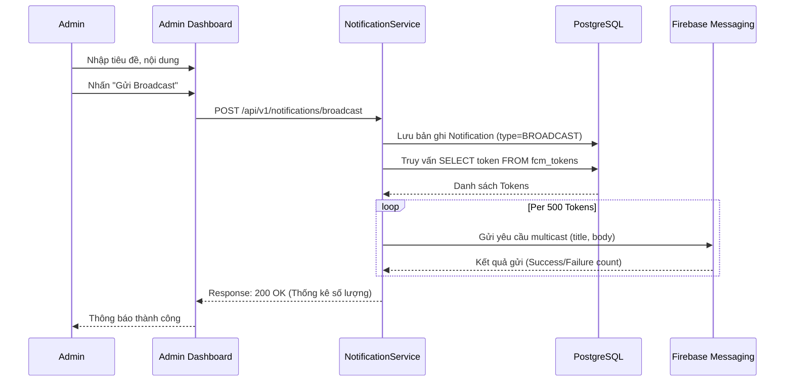

# Tài liệu Đặc tả Chi tiết: Quản lý Thông báo (Admin Notification Management)

Tài liệu này chi tiết hóa các chức năng quản lý thông báo dành riêng cho vai trò **Quản trị viên (Admin)**.

---

## 1. Tổng quan các Use Case

| ID             | Tên Use Case                        | Mô tả ngắn gọn                                                   |
| :------------- | :---------------------------------- | :--------------------------------------------------------------- |
| **UC-20.A1**   | Gửi thông báo Broadcast toàn trường | Gửi thông báo đến tất cả các thiết bị đã đăng ký trong hệ thống. |
| **UC-20.A2**   | Gửi thông báo theo nhóm đối tượng   | Gửi đến một tập hợp người dùng dựa trên Khoa, Lớp hoặc Vai trò.  |
| **UC-20.A2.1** | Gửi thông báo cho cá nhân           | Tìm kiếm và gửi thông báo trực tiếp cho một người dùng cụ thể.   |
| **UC-20.A3**   | Xem lịch sử thông báo đã gửi        | Quản lý, theo dõi trạng thái các thông báo Admin đã thực hiện.   |
| **UC-20.A4**   | Xóa/Thu hồi thông báo               | Ẩn thông báo khỏi lịch sử của người dùng.                        |

---

## 2. Đặc tả chi tiết từng Use Case

### UC-20.A1: Gửi thông báo Broadcast toàn hệ thống

#### 1. Mô tả

Cho phép Admin soạn thảo và gửi một thông báo tức thời đến tất cả người dùng (Sinh viên, Giảng viên, Nhân viên) đang sử dụng ứng dụng.

#### 2. Luồng công việc (Flow)

**Luồng chính (Main Flow):**

1. Admin truy cập vào module **"Notification Management"**.
2. Hệ thống hiển thị bảng điều khiển gửi tin.
3. Admin chọn phương thức **"Broadcast"**.
4. Admin nhập các thông tin:
   - **Header/Title**: Tiêu đề thông báo (Bắt buộc).
   - **Message Body**: Nội dung chi tiết (Bắt buộc).
   - **Action URL**: Đường dẫn điều hướng khi click (Tùy chọn).
5. Admin nhấn **"Send Now"**.
6. Hệ thống thực hiện:
   - Lưu thông báo vào bảng `notifications` với loại `BROADCAST`.
   - Truy vấn danh sách tất cả các Token hợp lệ từ bảng `fcm_tokens`.
   - Chia nhỏ danh sách token thành các batch (ví dụ 500 tokens/lần) để tối ưu gửi.
   - Gọi Firebase Cloud Messaging API thông qua `FcmService`.
7. Hệ thống hiển thị thông báo "Gửi thành công cho [X] thiết bị".

#### 3. Flow Diagram (Mermaid)

#### 4. Các ngoại lệ (Exceptions)

- **E1: Nội dung rỗng**: Hệ thống hiển thị thông báo lỗi ngay trên UI và không cho phép thực hiện bước tiếp theo.
- **E2: Firebase API lỗi**: Backend log lỗi và trả về mã 500. UI hiển thị "Hệ thống thông báo gặp sự cố, vui lòng thử lại sau".
- **E3: Không có thiết bị nào đăng ký**: Hệ thống báo "Không tìm thấy thiết bị nào để gửi".

---

### UC-20.A2: Gửi thông báo theo nhóm đối tượng (Targeted Notification)

#### 1. Mô tả

Admin có thể lọc danh sách người nhận theo các tiêu chí cụ thể để tránh làm phiền những người không liên quan.

#### 2. Luồng công việc (Flow)

**Luồng chính (Main Flow):**

1. Admin chọn phương thức **"Targeted Group"**.
2. Admin chọn **Loại nhóm (Filter Group)**:
   - **Theo Khoa (Department)**: Chọn danh sách 1 hoặc nhiều khoa.
   - **Theo Lớp (Class)**: Tìm kiếm và chọn mã lớp học.
   - **Theo Vai trò (Role)**: Chọn "Only Students" hoặc "Only Teachers".
3. Admin soạn thảo nội dung (Title, Body, URL).
4. Admin nhấn **"Send"**.
5. Hệ thống thực hiện:
   - Tìm kiếm `User ID` thỏa mãn điều kiện lọc.
   - Lấy danh sách `Token` gắn liền với các `User ID` đó.
   - Thực hiện gửi qua FCM tương tự UC-20.A1.
6. Hệ thống báo cáo kết quả.

#### 3. Các ngoại lệ (Exceptions)

- **E1: Nhóm được chọn không có thành viên**: Hệ thống cảnh báo "Vui lòng chọn nhóm có ít nhất 1 thành viên".

---

### UC-20.A2.1: Gửi thông báo cho cá nhân (Personal Notification)

#### 1. Mô tả

Admin có thể gửi thông báo riêng tư cho một người dùng duy nhất (Ví dụ: Nhắc nhở nộp học phí, mời lên làm việc riêng).

#### 2. Luồng công việc (Flow)

1. Admin vào tab **"Direct Message"** hoặc tìm kiếm người dùng trong danh sách **User Management**.
2. Admin tìm kiếm người nhận bằng **Email** hoặc **Mã số (Code)**.
3. Hệ thống hiển thị thông tin người dùng và trạng thái thiết bị (Online/Offline).
4. Admin soạn nội dung và nhấn **"Send Private"**.
5. Hệ thống:
   - Lưu thông báo vào DB gắn với `user_id` của người nhận.
   - Lấy tất cả Token của người dùng đó và đẩy qua FCM.

#### 3. Các ngoại lệ (Exceptions)

- **E1: Người dùng chưa từng đăng ký thiết bị**: Hệ thống báo "Người dùng chưa cài đặt nhận thông báo trên trình duyệt. Tin nhắn sẽ chỉ được lưu trong lịch sử khi họ đăng nhập."

---

### UC-20.A3: Xem lịch sử thông báo đã gửi

#### 1. Mô tả

Giúp Admin đối soát lại các tin nhắn đã gửi, xem thời gian gửi và nội dung đã truyền đạt.

#### 2. Luồng công việc (Flow)

1. Admin vào tab **"History"**.
2. Hệ thống hiển thị bảng danh sách các thông báo do Admin tạo ra.
3. Thông tin hiển thị: ID, Tiêu đề, Loại (Broadcast/Targeted), Người gửi, Thời gian tạo, Số lượng người nhận dự kiến.
4. Admin có thể nhấn **"View Detail"** để xem lại nội dung đầy đủ.

---

### UC-20.A4: Xóa/Thu hồi thông báo

#### 1. Mô tả

Trong trường hợp gửi nhầm thông tin sai lệch, Admin có thể xóa thông báo.

#### 2. Luồng công việc (Flow)

1. Trong danh sách lịch sử, Admin chọn **"Delete"** một thông báo.
2. Hệ thống yêu cầu xác nhận.
3. Khi xác nhận:
   - Backend đánh dấu `deleted_at` (Soft Delete) trong bảng `notifications`.
   - (Nâng cao) Gửi một lệnh đẩy "SILENT" qua FCM để yêu cầu Client xóa thông báo trong app (nếu app có logic này).
4. Người dùng sẽ không còn thấy thông báo này trong lịch sử của họ trên Portal.

---

## 3. Giao diện dự kiến (UI Prototypes)

- **Dashboard**: Widget hiển thị số lượng Token đang active.
- **Form gửi**: Cấu trúc Clean, có phần Preview thông báo hiển thị như thế nào trên điện thoại/máy tính.
- **Lịch sử**: Bảng phân trang (Pagination) với bộ lọc theo thời gian.

---

## 4. Các Quy tắc nghiệp vụ (Business Rules)

1. **Giới hạn tốc độ (Rate Limiting)**: Tránh gửi Broadcast quá nhiều lần trong thời gian ngắn (ví dụ: tối đa 5 lần/giờ) để tránh tình trạng spam.
2. **Theo dõi trạng thái (Analytics)**: Cần cố gắng thu thập phản hồi từ Firebase về số lượng tin nhắn thực tế đã được chuyển đến thiết bị thành công.
3. **Nội dung nhạy cảm**: Cần có bước kiểm tra từ khóa hoặc xác nhận 2 lần đối với các tin nhắn Gửi toàn trường.
